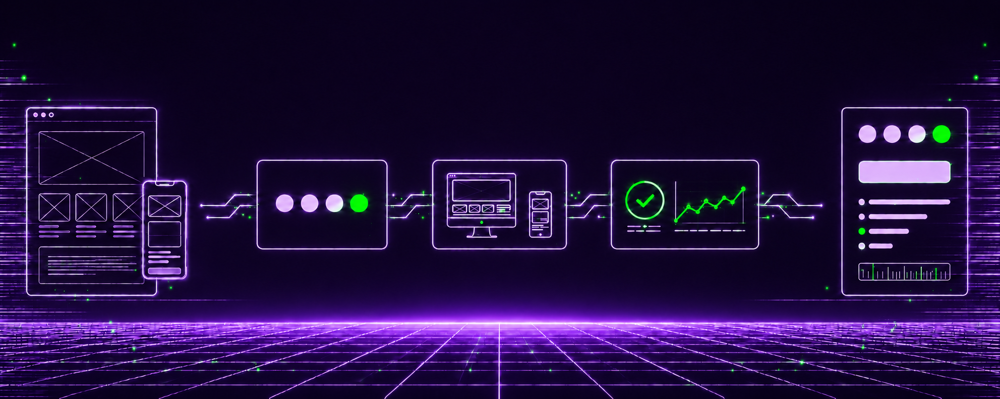

  

<h1 align="center">Hello — I’m Pushpaja ✦</h1>

  Software Engineer · Web Developer · Frontend Development · UI/UX

  

 

## ✦ About me

I’m Pushpaja Bommisetty, a Software Engineer and Web Developer focused on creating modern, accessible, and well-designed digital experiences.

My work combines frontend development, UI/UX, and reliable engineering to build web applications that are clear, useful, and easy to use.

- 💻 Interested in software engineering, web development, and frontend roles
- ♿ Building accessible and user-friendly web experiences
- 🎨 Growing my UI/UX and design-system skills alongside engineering
- 📊 Comfortable working with data, reporting, and analytics tools

 

## ✦ Technical stack

  

  JavaScript · TypeScript · Python · C · HTML · CSS · React · Tailwind CSS · Vite · Django · jQuery · SQL · MySQL · PostgreSQL · Git · GitHub · Postman · Figma · Photoshop

  Pandas · NumPy · Scikit-learn · Matplotlib · Seaborn · Jupyter Notebook · REST APIs · JSON · AJAX · Accessibility · SEO fundamentals

 

## ✦ Featured work

- [**TintMint**](https://github.com/pushpa1906/TintMint) — Create and preview polished UI color palettes.
- [**Reparo**](https://github.com/pushpa1906/Reparo) — Check WCAG color contrast and UI palette accessibility.
- [**ApplyFlow**](https://github.com/pushpa1906/ApplyFlow) — Organize job applications, progress, and follow-ups.

 

## ✦ Contribution activity

  <picture>
    <source
      media="(prefers-color-scheme: dark)"
      srcset="https://raw.githubusercontent.com/pushpa1906/pushpa1906/output/github-snake-dark.svg"
    />
    
  </picture>

  

 

## ✦ Let’s connect

  
  &nbsp;
  
  &nbsp;
  

 

  

